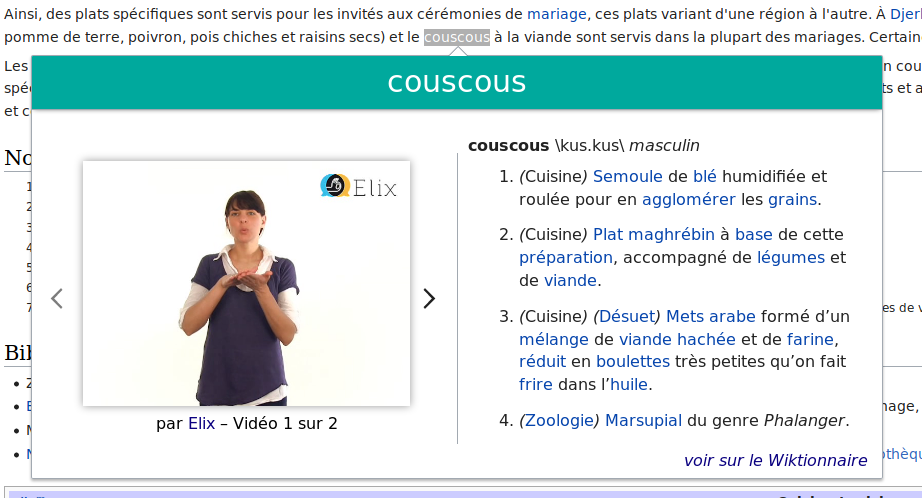
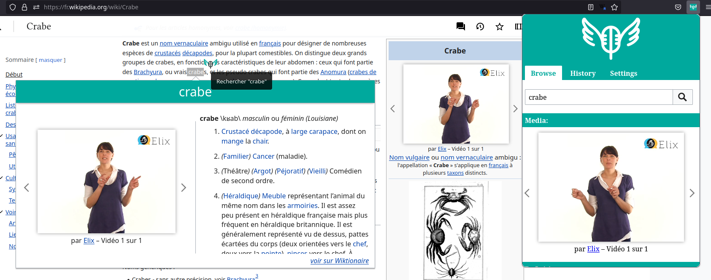

# SignIt
**Lingua Libre SignIt** translate a word in (French) Sign Language videos.

This extension allows you to translate a word into French sign language on any web page. When you read a text and come across a word you don't know, highlight that word, right click and click on the Sign it icon: the sign in LSF and the definition of the word in French will appear on a window. If a word is not available in LSF, we invite you to record it with our easy-to-use webapp on https://lingualibre.org. The definitions come from the French Wiktionary to which you can also contribute: https://fr.wiktionary.org.

## Install
* Firefox > Open: https://addons.mozilla.org/en-US/firefox/addon/lingua-libre-signit/ > Install.

Manual install is possible for Chrome, Chromium. Should be eqully possible with Windows Edge.

## Hacking

Firefox note: install of Firefox via snap install are not compatible with npm web-ext due to path changes, please [install Firefox from deb](https://support.mozilla.org/en-US/kb/install-firefox-linux#w_install-firefox-deb-package-for-debian-based-distributions). 

### Build & launch

```bash
# git clone the repository first, then...
npm install                 # Install dependencies
# Bump version : edit package.json and manifest.json, ex: 1.0.12 -> 1.0.13
npm run web-ext:build       # build the firefox extension into an instalable .zip
# Opens web browsers with lasted dev of SignIt and url defined in package.json
npm run web-ext:test-firefox         # Firefox
npm run web-ext:test-chromium        # Chromium
```

See also [Mozilla's web-ext](https://github.com/mozilla/web-ext)

### Inspect
- Firefox > Open url `about:debugging#/runtime/this-firefox` > Section `Temporary extensions` : "Lingua Libre SignIt" > Click `Inspect`. See also: [inspect Firefox extension](https://extensionworkshop.com/documentation/develop/debugging/).
- Chromium > Open url `chrome://extensions/` > Find 'Lingua Libre SignIt' : click `Inspect views service worker` or `Errors

### Mouse install
- Firefox > Open url `about:debugging#/runtime/this-firefox` > `Load temporary Add-on` : load ./dist/lingua_libre_signit-{latest}.zip
- Chromium > Open url `chrome://extensions/` > Click `Load unpacked` : find SignIt root directory.

## Visuals



## Development
```
├── _locales/ (inactive)
├── manifest.json (v.3) — defines extensions and dependencies rights.
├── background-script.js — main script.
├── sw.js — main script for Chromium browsers.
├── SignItCoreContent.js — creates duo panels "Video | Definition"
├── SignItVideosGallery.js — given urls, creates gallery of videos.
├── content_scripts/
|   ├── signit.js — creates above text SignIt popup
|   └── wpintegration.js — on wikimedia sites, if page's title has a sign language video available, then display smartly.
└── popup/
    ├── popup.js — creates top bar SignIt icon's popup, with search, history and settings.
    └── SearchWidget.js — handle the search queries
```

### MV2 -> MV3 Brief

Chrome web store had started deprecating the web extensions with manifest version 2 and since we were moving to chrome for bigger market share , we had to migrate our extension as per MV3 in order to publish it. Below are a few points on the achievements , challenges faced and hurdles that still persist :-

* In `popup.js` messages have been passed for various functions that are present in `sw.js` or `background-script.js` , well i.e., because  popup and other content scripts no longer have context of background page which happened to be the case in MV2.
* i18n : Even for `banana.i18n` , message passing is used. Reason being , earlier we could fetch banana when we fetched the context of background page using `browser.rutime.getBackgroundPage()`,but since we can no longer do that , message passing seemed the only right option. Setback of using this approach is that things become asynchronous , and you have to `await` until the message is fulfilled. It did become problematic when working inside constructor functions. Still has a lot of room for improvement and it is something that should be worked upon in future.

 While there were other options like making your own i18n function , based on the arguments received from `sw.js` , but that was a repetitive task when using i18n inside multiple files.
 
 Other option was to use `browser.i18n` native API. This was an ok option but didn't allow users to change to their desired language , only changed them when browser's language was different. For someone who didn't want the extension to run in his native language or wanted to run it in different language had no control.
* iframe instead of video tag : While this fix was made so that extension could work on sites with stricter CSPs like github or X, this broke the `twospeed` feature. The `twospeed` feature , when enabled allowed the users to see sign language video first in normal speed then in slow mo. It's code worked with event listeners of video tag , but since we replaced it with iframe , this feature no longer works. While you might think that accessing content document inside  iframe is no biggie , it doesn't work as the video embedded and the parent inside which the iframe is embedded in belong to different origins. Again this is something that can and should be improvised by future devs reading this.

## Contribute
### Contributors
We look for volunteers:
* Co-owners, JS developers
* Signers

### Contact
* [hugolpz](https://github.com/hugolpz)

### Code
- [Github: Lingua-libre/SignIt/Issues](https://github.com/lingua-libre/SignIt/issues) — tickets manager
- [Github: Lingua-libre/SignIt](https://github.com/lingua-libre/SignIt) — code (JS)
- [Translate SignIt's user interface](https://translatewiki.net/wiki/Translating:Lingua_Libre_SignIt)

## Documentation
* [:meta:Lingua Libre/SignIt](https://meta.wikimedia.org/wiki/Lingua_Libre/SignIt) — Wikimedia project page with mission statement.

## Services
* [Lingualibre.org > Recording Studio](https://LinguaLibre.org/wiki/Special:RecordWizard) — online tool to record words, once you specify a sign language, you can record videos of signed word at 400 per hour. They will be automatically available to SignIt.
* [Lingua Libre SignIt for Firefox](https://addons.mozilla.org/en-US/firefox/addon/lingua-libre-signit/) — a browser extension to click words in browser and show sign language videos generated via Lingualibre.
