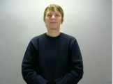
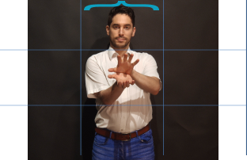

# Recording : Guidelines and Studio Guide

## 1. Lighting

Ensure good lighting by positioning yourself facing a light source to avoid shadows on your face.

### Good Light, Soft-Colored Background

- Ideal for signers as it fully utilizes multi-source and diffused lights.
- Examples:
  - 
  - 
- Studio Example:
- Example:
  - 
  - 

### Good Light, Black Background, Black Shirt

- Example:
  - 

### Good Light, Green Screen, Whitened Background

- Achieved with a green screen and post-editing. Integrates well with computer textual content, especially on white backgrounds.
- Examples:
  - 
  - 

### Zero Euro Studio with Correct Lighting

- Example:
- 

### Poor Lighting

#### Poor Light

- Lacks proper lighting and professional camera.
- Yellowish background can be partially neutralized with professional cameras' white balancing features.
- Example:
  - 

#### Poor Light and Irregular Background

- Similar issues as poor light with additional visual distractions.
  - Example:
  - 

## 2. Camera Position

Place the camera at eye level to make the lecture more engaging and natural. Use a tripod or stable surface.

- Example:
  - 

## 3. Background

Keep the background clean and uncluttered to avoid distractions. A neutral background is often best.

## 4. Sound Quality

Use an external microphone if possible for clearer audio. Minimize background noise and echo.

- **Software**: Use Audacity for audio recording. [open Source]

## 5. Framing

Frame yourself well in the shot, leaving some headroom and ensuring you're centered in the video.

- Minimum framing: from belly button to 10cm (3 inches) above the signer's head.
- Maintain consistent framing throughout a series.
- Position camera at shoulder or sternum level.

- Example:
  - 

## 6. Clarity

Speak clearly and at a moderate pace. Avoid excessive jargon unless it's relevant to your audience.

## 7. Eye Contact

Maintain eye contact with the camera to engage with your audience.
t

- Example:
  - 

## 8. Practice

Rehearse your material to smooth out any rough patches and ensure a confident delivery.

## 9. Technical Checks

Test your equipment (camera, microphone, and software) before starting to avoid technical issues.

- 

- 

## 10. Breaks

Take short breaks if your lecture is long to maintain energy and clarity.

## Conclusions

### Best Value for Money Investment

- Replicate New York Times' settings:
  - Good lighting
  - High-level device holder
  - Proper camera lens (≥ 8 MP)
  - Green screen background
